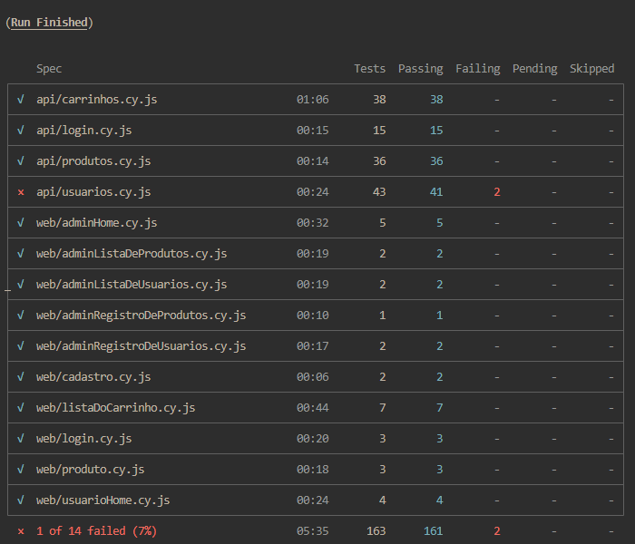

# Projeto de Automação QA - Serverest

## 📌 Objetivo

Este projeto foi desenvolvido como parte de um desafio técnico para a vaga de Analista de Qualidade de Software Pleno.

O objetivo é validar o módulo de cadastro de usuários de um e-commerce fictício, cobrindo:

- Testes automatizados de Front-end
- Testes automatizados de API
- Definição de cenários em BDD
- Registro de bugs encontrados
- Boas práticas de organização e manutenção

---

## 🌐 Sistema Testado

- Aplicação: Serverest  
- URL Front-end: https://front.serverest.dev/
- URL API : https://serverest.dev/

---

## 📊 Estratégia de Testes

Foram priorizados:

- Fluxos principais
- Validações obrigatórias de campos
- Testes negativos (dados inválidos e campos obrigatórios)
- Validação de status code e estrutura de resposta da API
- Independência entre cenários para evitar dependência de estado

---

## 📐 Estratégia Baseada na Pirâmide de Testes

Este projeto foi estruturado seguindo o conceito da Pirâmide de Testes, priorizando 
testes de integração e API como base principal da estratégia.

### Testes de Integração / API
A maior parte da cobertura foi concentrada na camada de API, com foco em:

- Validação das regras de negócio
- Validação dos status codes
- Validação do contrato de resposta
- Testes de duplicidade e dados inválidos
- Regras descritas na documentação da API

Essa abordagem garante maior confiabilidade, rapidez de execução e detecção precoce de falhas.

### Testes End-to-End (Web)
Os testes E2E foram direcionados principalmente para:

- Validação dos fluxos críticos do usuário
- Simulação de cenários reais
- Verificação da integração entre front-end e back-end

O foco foi validar o comportamento do sistema como um todo, evitando excesso de cenários 
na camada de interface.

---

## 🛠️ Tecnologias Utilizadas

- Cypress
- JavaScript
- Node.js
- Faker (geração de dados)
- Gherkin (BDD)

---

## 📁 Arquitetura do Projeto

A estrutura do projeto foi organizada de forma modular, separando responsabilidades por camadas:
```bash
└── 📁desafio-qa-serverest
    └── 📁bdd
        └── 📁api
            ├── carrinhos.feature
            ├── login.feature
            ├── produtos.feature
            ├── usuario.feature
        └── 📁web
            ├── adminHome.feature
            ├── adminListaDeProdutos.feature
            ├── adminListaDeUsuarios.feature
            ├── adminRegistroDeProdutos.feature
            ├── adminRegistroDeUsuarios.feature
            ├── cadastro.feature
            ├── listaDoCarrinho.feature
            ├── login.feature
            ├── produto.feature
            ├── usuarioHome.feature
    └── 📁cypress
        └── 📁e2e
            └── 📁api
                ├── carrinhos.cy.js
                ├── login.cy.js
                ├── produtos.cy.js
                ├── usuarios.cy.js
            └── 📁web
                ├── adminHome.cy.js
                ├── adminListaDeProdutos.cy.js
                ├── adminListaDeUsuarios.cy.js
                ├── adminRegistroDeProdutos.cy.js
                ├── adminRegistroDeUsuarios.cy.js
                ├── cadastro.cy.js
                ├── listaDoCarrinho.cy.js
                ├── login.cy.js
                ├── produto.cy.js
                ├── usuarioHome.cy.js
        └── 📁factories
            ├── carrinho.factory.js
            ├── login.factory.js
            ├── produto.factory.js
            ├── usuario.factory.js
        └── 📁fixtures
            ├── example.json
        └── 📁pages
            ├── adminHomePage.js
            ├── adminListaDeProdutosPage.js
            ├── adminListaDeUsuariosPage.js
            ├── adminNavbarPage.js
            ├── adminRegistroDeProdutosPage.js
            ├── adminRegistroDeUsuariosPage.js
            ├── cadastroPage.js
            ├── listaDoCarrinhoPage.js
            ├── loginPage.js
            ├── produtoPage.js
            ├── userHomePage.js
            ├── userNavbarPage.js
        └── 📁services
            ├── carrinhos.service.js
            ├── login.service.js
            ├── produtos.service.js
            ├── usuarios.service.js
        └── 📁support
            ├── commands.js
            ├── e2e.js
        └── 📁utils
            ├── deleteCarrinhos.js
            ├── deleteProdutos.js
            ├── deleteUsuarios.js
            ├── generateAuthTokens.js
            ├── generateCarrinho.js
            ├── generateEmail.js
            ├── generateName.js
            ├── generateNovoUsuario.js
            ├── generatePassword.js
            ├── generateProduto.js
    └── 📁img
        ├── image.png
    ├── .gitignore
    ├── BUGS.md
    ├── cypress.config.js
    ├── package-lock.json
    ├── package.json
    └── Readme.md
```

Essa arquitetura visa facilitar a manutenção, escalabilidade e reutilização de código.

---

## 📂 Descrição das Pastas

### 📁 `bdd/`
Contém os cenários escritos em Gherkin (BDD).

Utilizado para documentar os fluxos de negócio antes da automação.

Exemplo:
- `cadastro.feature`

---

### 📁 `cypress/e2e/web/`
Contém os testes automatizados de Front-end.

Aqui estão os cenários que validam a interface do usuário.

Exemplo:
- `cadastro.cy.js`

---

### 📁 `cypress/e2e/api/`
Contém os testes automatizados da API.

Valida os endpoints de cadastro e consulta de usuários.

Exemplo:
- `usuarios.cy.js`

---

### 📁 `cypress/pages/`
Implementa o padrão Page Object Model.

Responsável por centralizar:

- Seletores
- Ações
- Interações com a interface

Exemplo:
- `cadastroPage.js`

---

### 📁 `cypress/services/`
Camada responsável por centralizar as requisições à API.

Evita duplicação de código nos testes.

Exemplo:
- `usuarios.service.js`

---

### 📁 `cypress/fixtures/`
Contém massas de dados estáticas.

Utilizada para armazenar dados reutilizáveis em formato JSON.

Exemplo:
- `user.json`

---

### 📁 `cypress/factories/`
Responsável pela geração de dados dinâmicos.

Utiliza Faker e funções auxiliares para evitar dados fixos.

Exemplo:
- `userFactory.js`

---

### 📁 `cypress/utils/`
Contém funções utilitárias reutilizáveis.

Inclui validações, formatações e helpers genéricos.

Exemplo:
- `helpers.js`

---

### 📁 `cypress/support/`
Contém configurações globais do Cypress.

Responsável por:

- Comandos customizados
- Setup global
- Configurações iniciais

Arquivos:
- `commands.js`
- `e2e.js`

---

## 🧪 Onde Encontrar os Casos de Teste

### Testes Web

cypress/e2e/web/

### Testes de API

cypress/e2e/api/

### Cenários BDD

bdd/cadastro.feature


---

## ▶️ Como Executar o Projeto

### Pré-requisitos

- Node.js instalado
- npm ou yarn

---

### Instalar Dependências

```bash
npm install
```
---
Executar Testes com Interface
```bash
npx cypress open
```
---
Executar Testes em Modo Headless
```bash
npx cypress run
```
---
## 📈 Resultados da Execução dos Testes

Abaixo está o resultado da execução completa da suíte de testes em modo headless:

- Total de testes: 163
- Testes aprovados: 161
- Testes falhados: 2

Os testes com falha estão relacionados a comportamentos inconsistentes da API, 
que foram devidamente documentados no arquivo BUGS.md.

Essa execução demonstra a estabilidade da suíte e a confiabilidade dos cenários implementados.

!

---

## 🐞 Registro de Bugs

Os bugs identificados durante a execução dos testes estão documentados no arquivo:
```bash
BUGS.md
```
Cada bug contém:
- Título
- Severidade
- Passos para reprodução
- Resultado esperado
- Resultado atual
---
## 📐 Decisões Técnicas
As principais decisões tomadas neste projeto foram:
- Utilização do Cypress para testes Web e API, visando simplicidade e padronização
- Implementação do padrão Page Object Model
- Separação por camadas (tests, pages, services, utils)
- Uso de factories para geração de massa dinâmica
- Manutenção de BDD como documentação funcional
- Organização focada em escalabilidade e manutenção
---
## 👤 Autor

- Nome: Pedro Aparecido Possari
- Contato: pedropossari2@gmail.com
- LinkedIn: https://www.linkedin.com/in/pedro-possari/